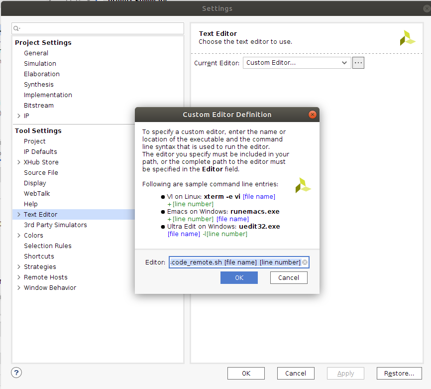

# 虚拟机里Vivado比实体机跑得还快？提升可达60%！
## 前言
在大规模的Vivado项目中，Implementation时间超过几个小时，因此等待(摸鱼)的时间无疑十分长，而且还有可能时序不通过。然而在Xilinx的论坛中有着一些虚拟机中比实体机跑的还快的传说，笔者实测快的不止一点。实测得到，在一个Block RAM资源占用率超过60%的项目中，Synthesis的速度和实体机相差不大，但是Implementation速度在实体机跑了85分钟，而在虚拟机跑了52分钟！  
对此，论坛有大神解释称是windows的Vivado的GUI日志打印的效率低，因此大量时间都浪费在IO中。从CPU占用率可以看到，在Windows下CPU利用率是很低的，而内存占用非常大，猜测一部分原因是优化问题导致大量cache miss，另外一部分原因是IO中浪费很多时间。论坛中也有大神说运行Implementation的tcl而不在Vivado直接Impelmentation，这样也会快很多，这个本人并未尝试，但是感觉有用。在此，针对虚拟机方法做一个简单的教程。  
**本教程适合于用Linux基础且需要提升Implementation速度的人**


## 虚拟机安装
针对特定的Vivado版本，建议使用此Vivado版本之前发布的Linux发行版(Vivado建议在测试过的Linux系统运行，毕竟Linux的兼容性不像Windows那样)。比如我使用Vivado2020.1，建议使用Ubuntu18.04以下的版本。使用VMWare Workstation进行安装，不会的跟着这个教程去做就行了。  
[https://blog.csdn.net/qq_39657434/article/details/112252844](https://blog.csdn.net/qq_39657434/article/details/112252844)  
内存分配尽量多分但不要超过实体机。
然后Xilinx官网下载Linux版Vivado，**chmod +x 下载文件**给运行权限，然后终端运行文件即可开始安装。

## 提高体验
Vivado跑的工程可以使用VMWare的共享文件夹进行共享，可在Windows与Linux随意访问，参考以下连接进行配置  
[https://zhuanlan.zhihu.com/p/43920548](https://zhuanlan.zhihu.com/p/43920548)  
打开Vivado会发现Linux下的字体渲染是有点随意的，完全没有边缘平滑。同时Vivado的内部代码编辑器是很垃圾的，需要配置外部编辑器，目前比较主流的是VSCode。不过在虚拟机内图形性能是有点差的，既然都配置共享文件夹了，有没有一种可能，可以在Linux中的Vivado双击跳转到Windows的VSCode？答案是可以的。  
方法是实体机做一个简单的服务器，接收虚拟机的跳转请求。这里实体机使用Python Flask实现，虚拟机使用Curl Post实现。  
首先我们需要将虚拟机的IP固定，跟着这个教程的前半部分做，到了后半部分固定Ubuntu ip时，可以使用ubuntu的GUI的设置中去固定ip、网关和dns，然后重启ubuntu即可。  
[https://blog.csdn.net/chinaxsw/article/details/1041605690](https://blog.csdn.net/chinaxsw/article/details/104160569)  
然后我们固定得到实体机的ip为192.168.65.1，ubuntu的ip为192.168.65.128，然后我们就能将这个固定ip写到flask服务器了。  
首先实体机需要安装Python且下载Flask库
```
pip install flask
```
并且VSCode的目录要加入到系统的PATH中。  
下载[脚本](./listener.py)，将脚本中的全局变量**SHARE_FOLDER_WINDOWS**、**SHARE_FOLDER_LINUX**替换成VMWare共享文件夹在Windows与Linux下的目录
然后运行这个脚本  
虚拟机端需要安装**curl、dialog**  
```
sudo apt-get install curl dialog
```
然后将[脚本](./vscode_remote.sh)放在某个目录，比如Home，然后**chmod +x vscode_remote.sh**给这个脚本可运行的权限  
Vivado设置外部编辑器**Tools->Settings->Text Editor->Custom Editor->右边3个点**  

填入以下命令  
```
/home/<用户名>/vscode_remote.sh [file name] [line number]
```  
这样Vivado就能通过Curl的HTTP Post方法将文件名和行数发送到实体机，实体机再将共享文件夹的地址替换成实体机中的真实地址，即可再实体机的VSCode打开。  
在实体机的Vivado外部链接VSCode会出现界面无响应，但是这种方法不会。

## 总结
虽然这种方法需要折腾不少时间，但是雀食方便很多，只需要把工程放在共享文件夹中，然后用法就和Windows中的Vivado一样。当然直接使用Linux系统某种程度上更方便，但是一些软件的缺失使得Linux也比较难办公，双系统切换也麻烦。实测虚拟机内性能损耗十分小，完全可以接受。另外也有人使用WSL来装Vivado，但是WSL配置桌面环境复杂且使用CPU渲染GUI，还是比较麻烦。